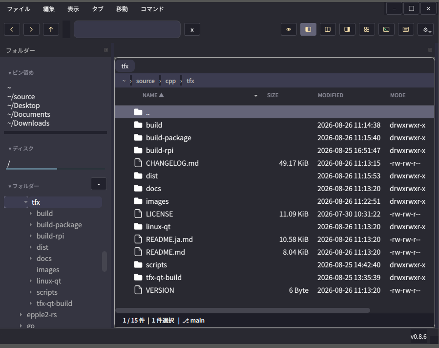
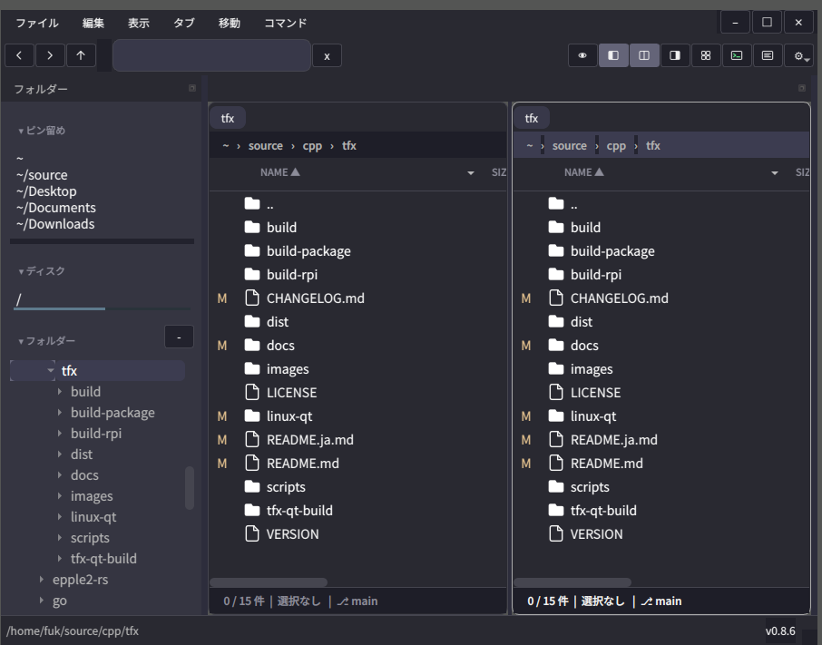
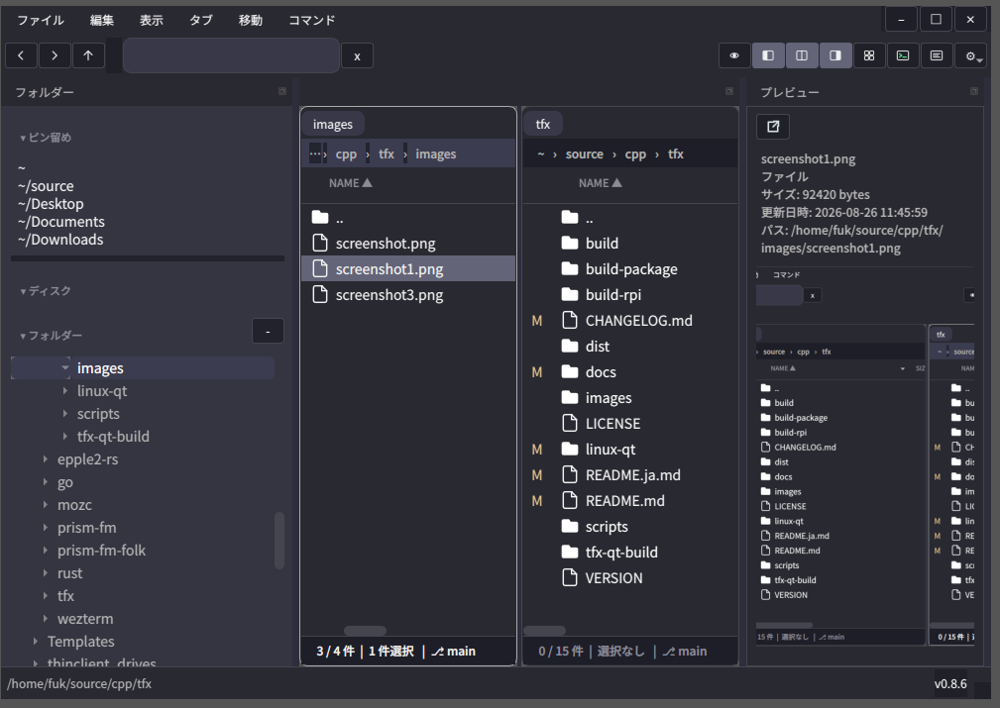
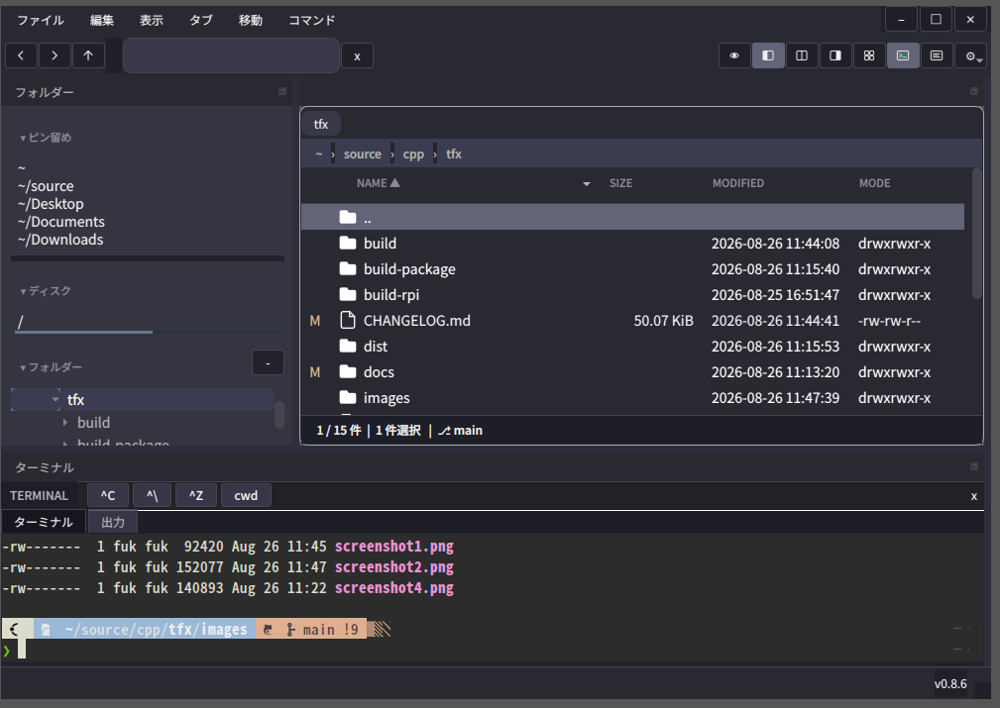
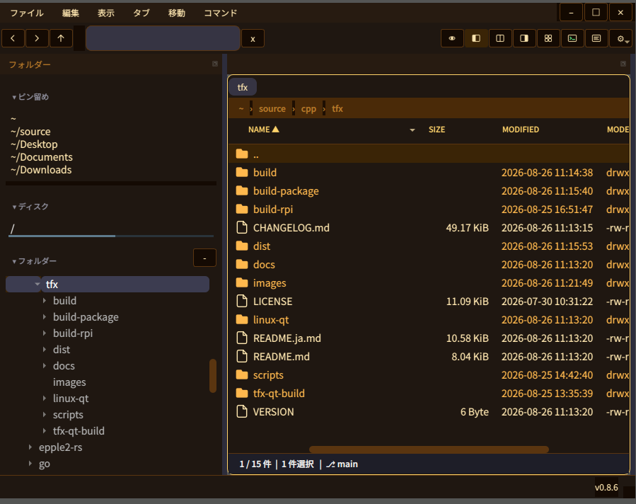

# tfx for Linux

**Linux 向け Terminal-inspired interface File eXplorer**  
Version: **0.8.7**

[English](README.md) | 日本語

`tfx-for-linux` は、`tfx` の C++/Qt による Linux 版実装です。キーボード操作を中心に据えた 2 ペイン型ファイルマネージャです。

<p align="center">
  
</p>

既定テーマは [prism-fm](https://github.com/fukuyori/prism-fm) に倣った半透明・角丸のデザインです。デスクトップが透けて見える暗い面、UI 用サンセリフ体、ゆったりした行間、選択はニュートラルなグレーで表現します。ファイル一覧のアイコンは tfx が自前で描画し(塗りのフォルダと線画のページ)、専用スロットの中央に配置して `[colors]` の色で着色します。デスクトップのアイコンテーマに関係なく同じ見た目になります。等幅フォントは意味のある箇所(ターミナルペイン、プレビューのソース表示)に限って使用します。配色・フォント・透過はすべて `config.toml` の `[colors]` / `[font]` / `[opacity]` で上書きできます。不透明なウィンドウにする場合は `[opacity] background = 1.0` を指定してください。

このリポジトリには Linux Qt 版のみを含めます。元の macOS SwiftUI 版のプロジェクトファイルは含めません。

## スクリーンショット

<table>
  <tr>
    <td width="50%">
      
      <br><sub><b>スプリット表示。</b>両側に同じフォルダを表示し、Git
      ステータス列で変更されたファイルを示しています。</sub>
    </td>
    <td width="50%">
      
      <br><sub><b>プレビューペイン。</b>選択項目の名前・種類・サイズ・更新日時・パスと、
      その下にサムネイルを表示します。</sub>
    </td>
  </tr>
  <tr>
    <td width="50%">
      
      <br><sub><b>ターミナルペイン。</b>作業ディレクトリがアクティブペインに追従する
      対話型シェルです。</sub>
    </td>
    <td width="50%">
      
      <br><sub><b>配色は自由。</b><code>config.toml</code> の
      <code>[colors]</code> を変更した同じウインドウです。</sub>
    </td>
  </tr>
</table>

## 必要環境

- Linux
- CMake 3.20 以上
- C++17 対応コンパイラ
- Qt 6 Widgets

## ビルド

```sh
scripts/build.sh
./build/tfx
```

クリーンビルドする場合:

```sh
scripts/build.sh --clean
```

ビルド後にそのまま起動する場合:

```sh
scripts/build.sh --run
```

フォルダを指定して起動する場合:

```sh
./build/tfx /path/to/folder
```

起動時のウインドウ位置とサイズを指定する場合:

```sh
./build/tfx --geometry 1280x780+80+40
```

フォルダ指定がない場合は、起動時のカレントディレクトリを表示します。

`tfx` は起動時にターミナルから切り離されるため、`&` を付けなくてもすぐにプロンプトが戻ります。ログ出力の確認などでターミナルに繋いだままにする場合は次を使用します:

```sh
./build/tfx --foreground
```

## テスト

```sh
scripts/build.sh --tests
ctest --test-dir build --output-on-failure
```

`scripts/build.sh` はデフォルトではテスト実行ファイルをビルドしません。`--tests` を付けてビルドしてください。

GitHub Actions では Linux Qt target の configure、build、tests、install
smoke test を実行します。

## 現在の実装範囲

- フォルダツリーとピン留めフォルダ（ピンはドラッグで並べ替え、フォルダをドロップしてピン留め）
- フォルダーサイドバーの表示切替、全折りたたみ、起動時表示制御
- 単独表示 / スプリット表示のファイル一覧（ペインごとに詳細表示／アイコン表示を切替）
- ドック化したペイン: サイドバー・左右ファイルペイン・プレビュー・ターミナルをドラッグで再配置・フローティング・タブ化。表示/非表示はウィンドウサイズを変えずに内部を再分割
- 範囲選択（クリック後 Shift+クリック）、個別選択（Ctrl+クリック）、余白からのドラッグによるラバーバンド選択
- ペインヘッダのクリック可能なパンくずパス表示（セグメントクリックでその階層へ移動、余白クリックでパス編集モードに切替）
- 起動パス制御: 左ペインは起動引数のフォルダ、指定がない場合は起動時のカレントディレクトリを表示。右ペインは `[startup] rightFolder` / `rightFolders` のフォルダ、どちらも未設定の場合は左ペインと同じフォルダを表示。この規則は起動時だけでなくスプリットを再表示するたびに適用され、右ペインは前回の場所を復元しません(タブと戻る/進む履歴も引き継ぎません)
- プレビュー、ターミナル、フォルダーサイドバーの起動時表示制御
- `--geometry` または `[startup] geometry` による起動時ウインドウ位置/サイズ指定
- ソース表示 / レンダリング表示の切替、外部画像ビューアボタン、複数選択サマリを備えたプレビューペイン
- ソース/レンダリング切替と外部ビューア起動のプレビュー用キーボードショートカット
- GitHub 形式のテーブルとローカル画像埋め込みに対応した Markdown プレビュー
- ZIP をフォルダのように閲覧（中へナビゲート、エントリを開く/展開）
- 対話型ターミナルペイン（QTermWidget。作業ディレクトリはアクティブペインに追従。利用不可時は簡易コマンドペインにフォールバック）。ターミナル内で tmux 使用中は cwd 同期ボタンがアクティブな tmux ペインのディレクトリを解決
- `~/.config/tfx/` に作成されるユーザー編集用 `config.toml`（ウインドウ/ペインの透過、ペイン別フォント、ターミナルのカラースキームを含む）
- `[[commands]]` によるユーザー定義コマンド（コンテキストメニュー/メニューバー、トークン展開、ショートカット衝突警告、コマンド出力ドック）
- ウインドウ、ドックレイアウト、表示状態、タブ、表示項目設定の復元
- 閉じるボタン、重複タブ抑制、タブ用コンテキストメニュー、復元タブの
  正規化を備えた複数タブのファイルペイン
- ファイル操作: 開く、このアプリケーションで開く(ネイティブ選択)、名前変更、リンク作成、新規ファイル/フォルダ、ゴミ箱、進捗/キャンセル付きのバックグラウンドコピー/カット/ペースト、パスコピー。シンボリックリンクはリンク内容を保持したままリンクとしてコピー。コピーはパーミッションと更新日時を保持
- ファイル/フォルダのドラッグ&ドロップ: ペイン間・外部ファイルマネージャとの間で移動（フォルダ上にドロップ、Ctrl でコピー）
- ドロップ先が分かるドラッグ&ドロップ表示: ハイライトされるのはフォルダの行だけで、行全体ではなくフォルダのアイコンと名前を枠で囲みます(それ以外にドロップすると表示中のフォルダに入り、ペイン全体が枠で示されます)。カーソル脇のバッジに「<フォルダ> へ移動」/「<フォルダ> にコピー」と表示されます(Ctrl の押下に追従)。影響を受けるペインは即時更新されます
- ペースト/ドロップ時の名前衝突処理（上書き、スキップ、名前変更、残り全件に適用する「すべてに適用」チェックボックス）。上書きはアトミックに置き換えられ、コピー失敗時も既存ファイルは保持
- 画像、リッチ/プレーンテキスト、URL、CSV、TSV のクリップボード内容をファイルとしてペースト（プレーンテキストとしてペーストも対応）
- 再帰サブフォルダ検索: 語を入力して Enter で現フォルダ以下を検索。結果は専用ビューにストリーミング表示し、フォルダ移動で検索を中止
- 検索結果のキーボード操作、コンテキストメニュー、結果列ソート、プレビュー
  更新、閉じるボタン、検索履歴
- ファイル一覧でのマウス/キーボード選択と、選択行の保持表示
- 各ペイン下部に件数・選択数・現在の Git ブランチを表示するステータス行
- ディレクトリ変更時のファイル一覧と Git ステータスの自動更新
- ステータスバーへのアプリバージョン表示
- ファイル一覧の表示項目:
  - ファイル名
  - 種類
  - サイズ
  - 作成日時
  - 更新日時
  - `drwxrwxr-x` 形式のファイルモード
  - Git ステータス

ファイル一覧ヘッダのメニューから、表示項目の表示/非表示と順序変更ができます。順序変更は設定ダイアログ内で項目名をドラッグ&ドロップして行います。
項目名(カラムヘッダ)のクリックでその列のソートに切り替わり、同じ列を再度クリックすると昇順/降順が反転します。ソート中の列は項目名に ▲/▼ が表示され、ソート列と昇順/降順はカラムレイアウトと一緒に保存します。

`..`(親フォルダ)の行は、どの項目・昇順降順でも常に先頭に固定され、名前以外の項目(種類・サイズ・日時・モードなど)は表示しません。これらは上位フォルダの情報でありノイズになるためです。

`Ctrl+Shift+S`(表示 ▸ ソート設定...、またはヘッダの右クリックメニュー)でキーボード操作のソート選択ダイアログを開きます。上下キー(または `k`/`j`)・数字キーで項目を選び、Space(または左右キー)で昇順/降順を切り替え、Enter で適用、Esc でキャンセルします。カラムに加えて **自然順** を選べます(`file2` が `file10` より前に並ぶ数値を考慮した名前順)。非表示にしている列や、ヘッダのないアイコン表示でもこのダイアログからソートできます。

## 設定

Linux 版も tfx for Windows と同じ考え方に合わせています。

- `~/.config/tfx/config.toml` はユーザーが編集する設定ファイルです。
- ウインドウ位置、最後に開いたパス、ペイン表示状態、ドックレイアウト、ピン留めフォルダ、タブ、表示項目レイアウトはアプリ管理のセッション状態として保存します。

起動時に `config.toml` が存在しない場合は自動作成します。既存ファイルは上書きしません。

現在対応しているセクション:

- トップレベル `version = 1` と `theme = "dark" | "light"`
- `[font]`
- `[colors]`
- `[opacity]`（`background` / `inactivePane` / `disabledItem`）
- `[startup]`
- `[naming]`
- `[shortcuts]`
- `[terminal]`
- `[openWith]`
- `[[commands]]`

Linux 版の詳細は [docs/configuration.md](docs/configuration.md) を参照してください。

## ロードマップ

[docs/roadmap.md](docs/roadmap.md) を参照してください。

## パッケージング

CMake の install target は実行ファイル、desktop entry、SVG icon、ドキュメントをインストールします。`scripts/build_package.sh` で DEB/RPM/tar.gz パッケージを `dist/` に作成できます。詳細は [docs/packaging.md](docs/packaging.md) を参照してください。

## リポジトリ

```text
https://github.com/fukuyori/tfx-for-linux.git
```

## ライセンス

本プロジェクトは [Apache License 2.0](LICENSE) の下で公開しています(macOS 版 `tfx` と同じライセンスです)。
